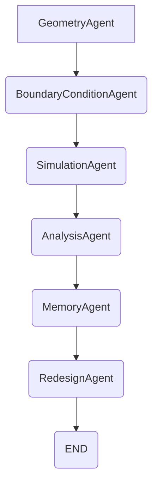

# The Foundry: AI-Powered Structural Engineering Platform

The Foundry is an AI-powered structural engineering platform designed to automate Finite Element Analysis (FEA) simulations and provide actionable redesign recommendations for solo engineers. It leverages a multi-agent pipeline built with LangGraph to streamline the structural analysis workflow, from CAD model ingestion to AI-driven design iteration.

## Features

The platform offers a comprehensive set of features to support structural analysis:

### CAD File Handling
*   **File Upload**: Supports uploading 3D models in `.stl`, `.step`, and `.stp` formats.
*   **Automatic Conversion**: Seamlessly converts `.step` and `.stp` files to `.stl` format using `gmsh` for consistent processing.
*   **Mesh Preprocessing**: Automatically performs mesh repair using `pymeshfix` and surface refinement using `gmsh` to ensure simulation readiness. Provides statistics on triangle count before and after preprocessing.
*   **Model Serving**: Serves processed 3D models from the backend for visualization in the interactive frontend.

### AI-Powered Force & Context Parsing
*   **Natural Language Force Description**: Users can describe forces in plain English (e.g., "Apply a 500 Newton downward vertical load on the top surface").
*   **Google Gemini Integration**: Utilizes the Google Gemini API to parse natural language force descriptions into structured data (magnitude, direction, region_id). It leverages context from user-painted faces, part material, and purpose for improved accuracy.
*   **Fallback Parser**: Includes a rule-based fallback parser if the Gemini API key is not provided or the API request fails.

### Finite Element Analysis (FEA) Simulation
*   **Dual-Solver Approach**:
    *   **FEniCSx Solver**: When available and properly configured, performs full 3D linear elasticity analysis using `dolfinx`, `ufl`, `gmsh`, `mpi4py`, and `petsc4py`. This involves:
        *   Building a volumetric mesh from the STL model using `gmsh`.
        *   Automatically identifying and applying fixed support boundary conditions (clamping one side).
        *   Applying distributed forces to user-defined regions.
        *   Solving for displacement and computing Von Mises stress.
    *   **Synthetic Fallback Solver**: If the FEniCSx solver encounters issues or is not available, a robust synthetic solver is used. This solver:
        *   Generates volumetric mesh coordinates using `gmsh`.
        *   Computes a realistic stress distribution based on mechanics of materials principles, optimized for large point clouds.
        *   Is self-calibrated against analytical benchmarks for improved accuracy and consistency.
*   **Stress & Safety Factor Calculation**: Determines maximum and minimum Von Mises stress and calculates the safety factor based on the part's material yield strength.
*   **Pass/Fail Verdict**: Provides a pass or fail verdict based on a configurable safety factor threshold (default: 2.0).
*   **Stress Heatmap**: Generates 3D stress point data for visualization as a heatmap on the model in the frontend.

### AI-Powered Redesign Recommendations
*   **LangGraph Agent-Driven**: A dedicated Redesign Agent within the LangGraph pipeline analyzes the geometry, simulation results, and historical iterations.
*   **Google Gemini for Recommendations**: Generates specific, actionable structural redesign recommendations (e.g., "Increase corner fillet radius from 1.0mm to 3.0mm and thicken adjacent wall from 2.5mm to 3.2mm") using Google Gemini.
*   **Detailed Improvements**: Each recommendation includes a predicted stress reduction percentage and a priority level.
*   **Fallback Recommendations**: Provides rule-based generic recommendations if the Gemini API is unavailable or returns an empty response.

### Session Management & Logging
*   **Unique Session IDs**: Each agent pipeline run is associated with a unique session ID.
*   **Iteration History**: An SQLite database (`foundry_memory.db`) stores a history of simulation results, forces, and redesign recommendations for each session, enabling iterative design.
*   **Event Logging**: A `SessionLogger` records critical application events (e.g., app startup, model upload, force parsing, simulation start/completion, calibration activities) to a `session_log.json` file.

### FEA Calibration
*   **Automated Calibration**: The synthetic FEA solver features an automatic self-calibration mechanism.
*   **Benchmark-Based Tuning**: It generates a standard cantilever beam STEP model, converts it to STL, runs the synthetic solver, and compares the results to an analytical solution.
*   **Target Stress Adjustment**: The calibration process adjusts the synthetic solver's internal scaling factor (`synthetic_target_pa`) to align with analytical benchmark results, enhancing its accuracy.
*   **Persistent State**: Calibration state and history are persisted in `fea_calibration.json`.

### User Interface (Frontend)
*   **Interactive 3D Viewer**: A React-based frontend utilizing `react-three-fiber` and `three.js` for dynamic 3D model visualization.
*   **Force Painting Tools**: Allows users to "paint" specific surface regions on the 3D model to define force application areas.
*   **Real-time Feedback**: Displays simulation status, stress levels (max/min/average Von Mises), safety factor, and a visual heatmap on the model.
*   **Chat & Timeline**: A system-engineer chat interface provides real-time updates, warnings, and AI agent outputs throughout the workflow.
*   **Task Progress**: Shows progress bars and elapsed time for computationally intensive tasks like model upload and simulation.
*   **Part Information**: Displays mesh statistics, estimated volume, material, and calculated part weight.

## Tech Stack

### Backend
*   **Framework**: Flask, Flask-CORS
*   **AI/ML Orchestration**: LangGraph (for multi-agent pipelines), Google Gemini API (for NLP and recommendations)
*   **Finite Element Analysis**: FEniCSx (Dolfinx, UFL, MPI4py, PETSc4py)
*   **Meshing**: Gmsh (for CAD conversion and volumetric meshing), Trimesh (for mesh stats, optional), Pymeshfix (for mesh repair, optional)
*   **Database**: SQLite (for agent memory and iteration history)
*   **Utilities**: `python-dotenv`, `numpy`, `subprocess`, `pathlib`, `json`, `datetime`, `threading`, `uuid`, `re`

### Frontend
*   **Framework**: React.js
*   **3D Graphics**: `@react-three/fiber`, `@react-three/drei`, `three.js`
*   **Build Tool**: Vite

## How It Works

The Foundry orchestrates a sophisticated workflow to automate structural analysis:

1.  **Model Ingestion**: The user uploads a 3D CAD model (STL, STEP, or STP). STEP files are automatically converted to STL. All models undergo mesh preprocessing, including repair and surface refinement, to ensure a high-quality mesh for simulation.
2.  **Part Context Definition**: The user provides essential context by specifying the part's material (e.g., steel, aluminum) and its purpose (e.g., "motor mounting bracket").
3.  **Force Specification**:
    *   **Natural Language Input**: The user describes the applied loads in plain English (e.g., "500 Newtons pushing down on the top face").
    *   **AI Parsing**: The backend utilizes the Google Gemini API to parse this description into structured force data, including magnitude, direction, and target region.
    *   **Interactive Painting**: The user then interactively paints specific regions on the 3D model surface in the frontend to precisely define where each parsed force is applied.
4.  **Multi-Agent FEA Pipeline Execution**:
    Upon initiation, a LangGraph multi-agent pipeline is triggered:
    *   **`GeometryAgent`**: Analyzes the model for critical geometric features (e.g., thin walls, sharp corners, holes) and potential risk areas.
    *   **`BoundaryConditionAgent`**: Takes the parsed and painted force data, normalizes it, and prepares it as precise boundary conditions for the FEA solver.
    *   **`SimulationAgent`**: Executes the core FEA. It first attempts to use the FEniCSx solver for a high-fidelity linear elasticity analysis. If FEniCSx fails or is unavailable, a calibrated synthetic solver provides a realistic stress approximation.
    *   **`AnalysisAgent`**: Interprets the raw stress results from the simulation. It calculates the safety factor, identifies peak stress zones, and determines if the part passes or fails.
    *   **`MemoryAgent`**: Stores the inputs, simulation results, and redesign recommendations of the current iteration, along with a history of previous iterations, into an SQLite database. This provides continuity and context for iterative design.
    *   **`RedesignAgent`**: Based on the geometry analysis, simulation failure report, and historical context (from `MemoryAgent`), this agent uses Google Gemini to generate specific, actionable design modifications to improve the part's structural integrity.
5.  **Results & Recommendations Display**: The frontend updates with the simulation results (stress heatmap, max/min stress, safety factor, pass/fail verdict) and presents the AI-generated redesign recommendations.
6.  **FEA Calibration**: The synthetic FEA solver undergoes an automated, periodic calibration process. This involves running a benchmark (e.g., a cantilever beam model), comparing its synthetic stress outputs to known analytical solutions, and adjusting its internal parameters to maintain accuracy. This calibration state is persisted for future runs.

## Local Setup Instructions

To set up and run The Foundry locally, follow these steps:

1.  **Clone the repository**:
    ```bash
    git clone https://github.com/your-repo/foundry.git # Replace with the actual repository URL
    cd foundry
    ```

2.  **Backend Setup**:
    a.  **Create a Python virtual environment and install dependencies**:
        ```bash
        cd backend
        python -m venv .venv
        source .venv/bin/activate
        
        # Install core dependencies
        pip install Flask Flask-Cors python-dotenv numpy
        
        # Install FEA-related dependencies
        # Note: FEniCSx components (dolfinx, mpi4py, petsc4py) can have complex installation requirements.
        # It is often recommended to use a Docker container for Dolfinx or install in a dedicated environment.
        pip install "dolfinx>=0.7.0" "mpi4py>=3.0" "petsc4py>=3.17" ufl gmsh
        
        # Install mesh utilities (optional, but highly recommended for full functionality)
        pip install trimesh pymeshfix
        
        # Install AI model libraries (for Google Gemini and LangGraph integration)
        pip install google-generativeai langgraph
        ```
    b.  **Environment Variables**: Create a `.env` file in the `backend/` directory with your Google Gemini API key:
        ```
        GEMINI_API_KEY="YOUR_GEMINI_API_KEY_HERE"
        ```
        If the `GEMINI_API_KEY` is not set, the system will automatically fall back to rule-based parsers and recommendation generators.
    c.  **Run the Backend Flask Application**:
        ```bash
        python app.py
        # The backend will run on http://127.0.0.1:5000
        ```
        This command will also create `uploads/` and `models/` directories within `backend/` if they do not already exist, which are used for storing uploaded files and calibration data.

3.  **Frontend Setup**:
    a.  **Install Node.js dependencies**:
        ```bash
        cd ../frontend
        npm install
        ```
    b.  **Run the Frontend Development Server**:
        ```bash
        npm run dev
        # The frontend will typically run on http://localhost:5173
        ```
        Ensure your `VITE_API_BASE_URL` in the frontend's environment configuration (e.g., a `.env` file in `frontend/`) points to your backend's address (default: `http://127.0.0.1:5000`).

4.  **Access The Foundry**: Open your web browser and navigate to the frontend URL (e.g., `http://localhost:5173`).

## Agent Architecture

The Foundry's core logic is powered by a LangGraph multi-agent pipeline, designed to autonomously manage the structural analysis and redesign process. The state of this pipeline is represented by a `PipelineState` TypedDict, which is passed between agents.

The agents and their sequential flow are as follows:

1.  **`GeometryAgent`**:
    *   **Role**: Initiates the analysis by performing a detailed geometric assessment of the 3D model.
    *   **Inputs**: `stl_filename`
    *   **Outputs**: `geometry_analysis` (bounding box dimensions, thin-wall regions, sharp interior corners, through-holes, estimated minimum cross-sectional area, estimated volume, and associated risk features).
    *   **Functionality**: Utilizes `trimesh` (if available) and custom algorithms to extract geometric metrics and identify potential structural weak points based on shape characteristics.

2.  **`BoundaryConditionAgent`**:
    *   **Role**: Processes and validates the user-defined forces and their application regions.
    *   **Inputs**: `forces` (structured data from the NLP parser), `painted_faces` (data from user interaction on the 3D model).
    *   **Outputs**: `boundary_conditions` (a normalized list of forces, including calculated centroids, normals, and areas for each painted face).
    *   **Functionality**: Ensures that all forces are correctly mapped to painted regions on the model and that their vectors are normalized, preparing the data for FEA.

3.  **`SimulationAgent`**:
    *   **Role**: Executes the Finite Element Analysis (FEA) based on the geometry and boundary conditions.
    *   **Inputs**: `stl_filename`, `boundary_conditions` (`forces`), `resolution`, `part_context`
    *   **Outputs**: `simulation_result` (max/min stress, safety factor, `stress_points` for visualization, and the specific solver used).
    *   **Functionality**: Delegates to `run_fenicsx_simulation`, which intelligently selects between the FEniCSx solver or the calibrated synthetic fallback solver, ensuring that a simulation result is always obtained.

4.  **`AnalysisAgent`**:
    *   **Role**: Interprets the raw FEA results to identify structural performance.
    *   **Inputs**: `simulation_result`, `part_context`
    *   **Outputs**: `failure_report` (material properties, yield strength, stress zones clustered by location, and a list of failed zones if the safety factor threshold is not met).
    *   **Functionality**: Calculates the safety factor relative to the material's yield strength and clusters high-stress points to pinpoint areas of potential failure, providing a structured report.

5.  **`MemoryAgent`**:
    *   **Role**: Manages the persistent storage and retrieval of session-specific iteration history.
    *   **Inputs**: `session_id`, and implicitly the results from `AnalysisAgent` (for saving).
    *   **Outputs**: `session_id`, `iteration_history` (a list of previous pipeline states), `iteration_number` (current iteration count).
    *   **Functionality**: Ensures a unique session ID. It loads all past simulation results and recommendations for the current session from an SQLite database (`foundry_memory.db`), providing valuable context for the `RedesignAgent`. It also saves the current iteration's complete state after the `RedesignAgent` has completed.

6.  **`RedesignAgent`**:
    *   **Role**: Generates specific, actionable recommendations for structural improvements.
    *   **Inputs**: `geometry_analysis`, `failure_report`, `iteration_history`, `part_context`
    *   **Outputs**: `redesign_recommendations` (a list of prioritized suggestions with specific geometric changes and predicted stress reductions).
    *   **Functionality**: Considers all available information (geometry flaws, failure zones, material properties, and past design iterations) to formulate precise redesign advice using the Google Gemini API (or a rule-based fallback). It is responsible for saving the complete iteration data to the `MemoryAgent`'s store.

**Agent Flow Diagram**:



## DGX Integration

The provided source code for The Foundry, encompassing both the backend Flask application and the frontend React components, does not contain any explicit or implicit integration points for NVIDIA DGX systems.

While the frontend displays a "DOCKER READY" badge, this indicates the application's ability to run within a containerized environment, which is a common deployment practice and not specific to DGX hardware. All computational tasks, including Finite Element Analysis (FEniCSx solver or synthetic fallback) and AI model inference (Google Gemini), utilize standard Python libraries and processes. There are no specialized NVIDIA libraries (e.g., CUDA, cuDNN), hardware acceleration calls, or environment variables present in the codebase that would indicate specific optimization or utilization of DGX-specific hardware or software infrastructure.